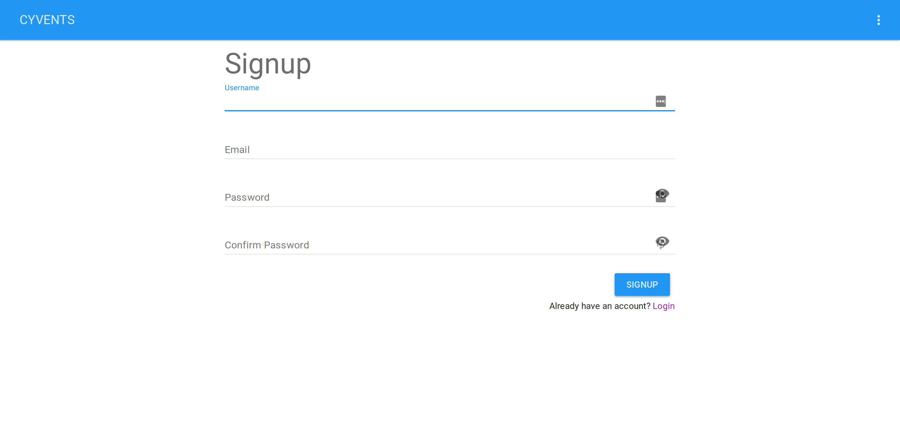

# Project Narratives

## Section 16 WGetter (at Workiva, Spring 2018)

(The app cannot be shown as it is Workiva property and I no longer have access to it)

Towards the end of my internship at Workiva during the summer/fall of 2017, I was assigned a project to do in the spare time between other projects. The purpose of this new project was to build an application to replace an antiquated, disfunctional python script used by the Workiva salesforce. In order to build this app, I learned how to use Electron to build and package a web app into an installable desktop app that works on all OS's. This was especially important since both Macs and PCs are used at Workiva. The project primarily consisted of me porting the Python script over to JavaScript, then building a UI around that with WebComponents to allow our salesforce team to quickly and easily download customer financial information.

## CyGames (at ISU, Spring 2017)

CyGames was a project done for SE 339: Software Architecture at Iowa State University. The grand vision of this project was to build an app that allowed people to quickly hop into multiplayer games of Pong, Snake, Chess, etc. while also being able to chat with opponents and anyone in the lobby. To accomplish this, I learned how to use NodeJS to implement web sockets both for chat and multiplayer gaming. We also used Firebase to implement user Authentication. Our goal was to make the code modular enough that it would be easy to implement more games after the first (pong) worked well.

## Go Getter Social (at ISU, Summer 2017)

Go Getter Social was a project done for SE 329: Project Management at Iowa State University. The grand vision of Go Getter Social was to build an app that allowed people to quickly and easily meet up with each other or find out where people were hanging out. For this project, I learned how to use VueJS, a front-end web application framework, as well as many valuable project management tools such as GitLab's issues and project boards. I also learned how to handle being moved from one project to another mid semester, and how that affects team dynamics.

## 360 Web Cams for Zoos and Aquariums (ISU Senior Design, Spring/Fall 2018)

360 Web Cams for Zoos and Aquariums is a project I am doing for SE 491: Senior Design at Iowa State University. The grand vision of the project is to allow zoos to quickly and easily mount 360 cameras in zoo enclosures that they can remotely start/stop streaming from. To accomplish this, I used the technical experience from personal projects and my internship at Workiva, along with project management skills learned at ISU to lead the Front-end side of the project. I also played a large role in overall architecture decisions due to my experience with web development.
